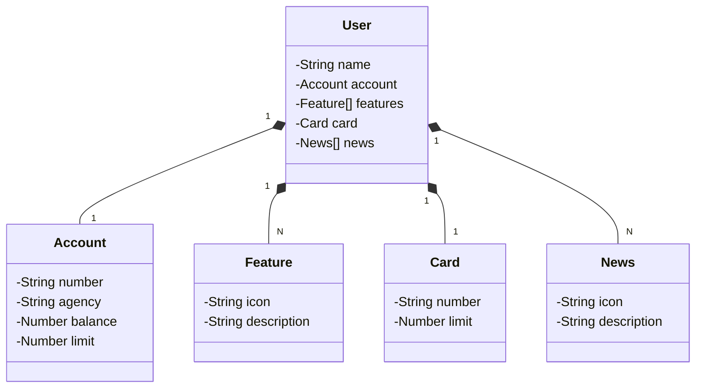

# Santander Dev Week

Java RESTful API criada para a Santander Dev Week.

## Principais Tecnologias
- **Java 17**: A versão LTS mais recente do Java, aproveitando as inovações e estabilidade da linguagem.
- **Spring Boot 3**: A mais nova versão do Spring Boot, que maximiza a produtividade do desenvolvedor por meio da autoconfiguração.
- **Spring Data JPA**: Simplifica a camada de acesso aos dados, facilitando a integração com bancos de dados SQL.
- **OpenAPI (Swagger)**: Criação de uma documentação de API eficaz e fácil de entender, alinhada com a produtividade do Spring Boot.
- **Railway**: Facilita o deploy e monitoramento das soluções na nuvem, além de oferecer diversos bancos de dados como serviço e pipelines de CI/CD.
- **Testes Unitários com Mockito e JUnit**: Testes unitários são implementados utilizando **Mockito** para mock de dependências e **JUnit** para validação dos comportamentos da aplicação.

## Diagrama de Classes (Domínio da API)

